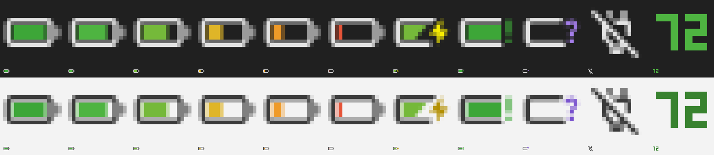

# Steam Controller 2026 battery

*[Version française](README.fr.md)*

The battery level of the Steam Controller 2026, permanently, in the Windows
notification area. A single binary of about 250 KB — no runtime, no installer —
that costs nothing at all when the controller is away.



*Every state, on a dark then a light taskbar — enlarged, then at actual size.*

Native Rust, two dependencies: `hidapi` to talk to the controller, `windows-sys`
for Win32. No GUI framework.

## Getting it

Grab `sc-battery.exe` from the
[latest release](https://github.com/fraustiz/steam-controller-battery/releases/latest)
and run it. Nothing to install: it depends only on system DLLs, so it can be
copied anywhere.

## What the icon says

| Situation | Icon |
|---|---|
| Controller connected | Battery filled and coloured by level, one of eight steps |
| Charging | The same level, plus a bolt |
| **Off on its dock** | A frame marked with a question mark |
| Nothing connected | A crossed-out plug |

The dock state deserves its own icon because the level is genuinely unknown
there: a powered-off controller emits nothing. Drawing an empty battery would
read as "0 %", which is a different claim entirely.

- **Hover** — level, cell voltage, charge state.
- **Left click** — restarts reading if it had stopped for want of hardware.
- **Right click** — the menu below.

A balloon warns at 20 % and again at 10 %, once per discharge.

## Menu

**Ring the controller** plays a short tune on the haptic actuators, to find it
in a room or to tell which one it is. The entry is greyed out while the
controller is off — its actuators receive nothing then.

The melody comes from a MIDI file, converted **offline** into a frozen table by
a separate tool. Embedding a MIDI parser to replay a second and a half of music
would have cost a whole dependency against a few hundred bytes of table.

**Show the percentage** replaces the battery with the number itself, coloured by
level. That replacement is a constraint, not a preference: inside a battery
frame, 16 pixels leave room for 3×5 digits, which are barely decipherable.
Without the frame the same digits occupy 6×10 — four times the area. The digits
are a hand-drawn bitmap font; handed to GDI they would spread over two grey
pixels and become unreadable again.

**Start with Windows** writes a value under the current user's `Run` key.
Nothing more — no service, no scheduled task, no elevation.

## Language

English and French. The system locale decides, English being the fallback.

```bash
sc-battery.exe --lang fr
```

forces the language for that run.

## Simulation mode

```bash
sc-battery.exe --debug
```

The menu then gains a level of your choosing, charging, dock and disconnection.
The hardware is no longer queried at all — the reading thread would overwrite
the chosen values.

It exists because some states have to be earned: an 8 % battery does not happen
on demand, and checking the rendering on a light taskbar means changing the
system theme.

The tooltip is prefixed with `[simulated]`. Without that mention one ends up
taking an invented value for a measurement — the very mistake this mode is meant
to expose.

## Consumption

This is the constraint that shaped the architecture. The process is a hidden
window blocked in `GetMessage`: while nothing happens, it is not scheduled at
all.

| Situation | What runs | Cost |
|---|---|---|
| Nothing plugged in | Nothing. The reading thread has ended. | Zero wakeups |
| Dongle plugged, controller off | One attempt every 5 s | negligible |
| Controller connected | One thread listening to the stream | 0.29 % of one core |

Measured over two minutes with a controller connected — the worst case:
344 ms of CPU, 2.05 MB of private memory, three threads. The 11.6 MB the task
manager shows count system DLLs shared with the rest of the machine.

Returning to the dormant state is driven by `WM_DEVICECHANGE`, which Windows
broadcasts to every top-level window — no subscription to maintain.

One accepted nuance: while the dongle stays plugged in, the reading thread
retries every five seconds even with the controller off. Turning on an already
paired controller produces no device event, since the dongle itself has not
moved; without that repeated attempt it would never be seen coming back.

### The responsiveness trade-off

The first version polled every thirty seconds. Putting the controller on its
dock therefore took up to half a minute to show, which is too long for a gesture
one expects immediate feedback from.

But the controller emits its power state by itself, every three and a half
seconds. A thread now stays listening and forwards each report: charging appears
within seconds, and no timer runs at all.

The price is traversing the 270 Hz input stream that arrives on the same
interface. Traversing is not processing — each report costs one byte comparison,
and the kernel receives them anyway, whether we read them or not.

That price was measured: **0.29 % of one core**, against 0.035 % for periodic
polling. Nine times more, to go from half a minute to a few seconds of latency.
In absolute terms it is still 0.3 % of a single core, and only while a
controller is connected — but it is a trade, not a free lunch.

## The protocol

None of this is documented by Valve; all of it was established by probing the
hardware. The detail lives in the header of [`src/hid.rs`](src/hid.rs).

The dongle (PID `0x1304`) exposes several HID interfaces on `usage_page`
`0xFF00`. The one with `usage` `0x0002` is the control interface; the others,
`usage` `0x0001`, are the pairing slots — only one emits, the one where a
controller is actually connected.

Input reports are numbered. Two matter:

| id | rate | contents |
|---|---|---|
| `0x42` | ~270 Hz | buttons, axes, trackpads, gyroscope |
| `0x43` | ~0.3 Hz | **power state** |

Report `0x43` is fifteen bytes:

```text
[0] 0x43        report id
[1] state       0x01 discharging, 0x02 charging, 0x04 charged
[2] percentage  0 to 100
[3] voltage     cell, 16-bit little-endian, millivolts
[5] voltage     second value, role not established
[7] supply      16-bit little-endian, millivolts; zero off mains
[9] current     16-bit little-endian, milliamps; zero at full charge
```

Three states, read off the hardware:

| Situation | [1] | [7..9] | [9..11] |
|---|---|---|---|
| Off the dock, 94 % | `0x01` | 0 | 0 |
| Charging, 96 % | `0x02` | 4800 mV | 175 mA |
| On the dock, 100 % | `0x04` | 4860 mV | 0 mA |

### Detecting a powered-off controller on its dock

Channel `0x01` swaps interfaces depending on the controller's state, and that is
what makes the detection possible:

| Controller | slot (`usage 0x0001`) | control (`usage 0x0002`) |
|---|---|---|
| on | answers | refused |
| off, **on the dock** | refused | **answers** |
| off, next to the PC but off the dock | refused | refused |
| off, far away | refused | refused |

The last two cases are what give the test its value. A powered-off controller
sitting thirty centimetres from the dongle stays silent: this is neither a
remembered pairing nor mere radio range. Only the dock's contact — the very one
that charges it — opens the channel. The signal is therefore exact: it says "on
the dock", not "somewhere nearby".

The level, however, remains out of reach: it travels only in the input reports,
which a powered-off controller does not emit.

### Two mistakes worth recording

**The state byte lied once.** A single reading taken on the dock showed `0x04`,
hence the hasty conclusion that `0x04` meant "charging". The battery was in fact
already full: `0x04` means *charged*, and `0x02` is what signals a charge in
progress. Generalising from one measurement produced an indicator that could
never light up.

Nothing in the tests could have caught it — they faithfully replayed the misread
sample. It took a contradictory observation, voltage and level climbing while
`charging` was false, to bring it down.

**Attribute `0x0B` is not a gauge, and not a constant either.** It read `4000`
without moving over four minutes, hence "design constant". Those four minutes
were all taken with the controller awake; queried powered-off on its dock, it
reads `64000`. Thirty minutes of monitoring during a charge settled it: it takes
only those two values, flips with the state, and never progresses. Its
hexadecimal writing hints at the reason — `0x0FA0` against `0xFA00`, the same
digits shifted by one nibble.

The lesson matters more than the detail: a field observed in a single state is
not a field observed.

Also ruled out: the registers read by command `0x89`, which are configuration,
and report `0x7B`, which carries radio telemetry.

## Icons

The shapes come from [Material Symbols](https://fonts.google.com/icons),
retouched, then rasterised **offline** at each of the four sizes Windows asks
for depending on screen density — 16, 20, 24 and 32 pixels. Drawn at each size
rather than resized: shrinking a 24 dp grid to 16 px puts strokes across two
pixels and turns them grey.

The generated masks carry opacity only. Colour is decided at render time, which
lets the frame and the bolt follow the system theme — a light frame would vanish
on a light taskbar — while level tints stay fixed, since they carry information
rather than decoration.

## Building

```bash
cargo build --release      # target/release/sc-battery.exe
cargo test                 # full suite, no hardware needed
cargo test -- --ignored    # real-controller checks, and the icon contact sheet
```

## Structure

| File | Role |
|---|---|
| [`src/hid.rs`](src/hid.rs) | Protocol and decoding. Knows nothing of Win32. |
| [`src/icon.rs`](src/icon.rs) | Icon composition. Pure functions. |
| [`src/icons.rs`](src/icons.rs) | Icon masks, generated offline. Do not edit by hand. |
| [`src/state.rs`](src/state.rs) | State machine, notification thresholds. No I/O. |
| [`src/tray.rs`](src/tray.rs) | `Shell_NotifyIcon`, menu, balloons. |
| [`src/settings.rs`](src/settings.rs) | Preferences, in our own registry branch. |
| [`src/autostart.rs`](src/autostart.rs) | The current user's `Run` key. |
| [`src/i18n.rs`](src/i18n.rs) | Translations. A missing one does not compile. |
| [`src/debug.rs`](src/debug.rs) | Simulation mode, behind `--debug`. |
| [`src/main.rs`](src/main.rs) | Hidden window, reading thread, message loop. |

## Limits

- 2.4 GHz dongle and USB only. Bluetooth uses another report format and is not
  handled.
- Steam Controller 2026 only.
- Windows only.

## Credits and licences

The code is under the MIT licence (`LICENSE`). Two components come from
elsewhere and keep their own terms, both detailed in
[THIRD-PARTY.md](THIRD-PARTY.md):

- **Icon shapes** derive from [Material Symbols](https://fonts.google.com/icons)
  by Google, under Apache 2.0.
- **The haptic frequency tables** come from
  [SteamHapticsSinger](https://github.com/CrazyCritic89/SteamHapticsSinger) by
  CrazyCritic89, after SteamControllerSinger by Pila, under BSD-3-Clause — by way
  of the sibling project
  [shs-studio](https://github.com/fraustiz/steam-haptics-studio).
